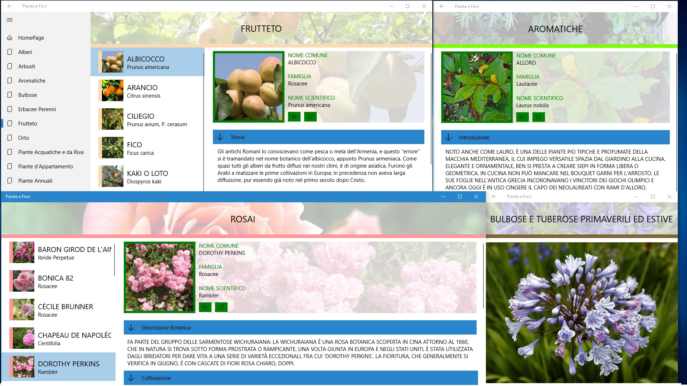
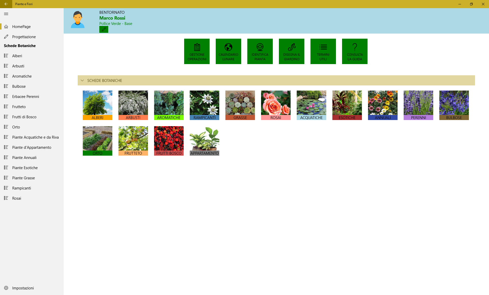

# Piante-e-Fiori

Versione 1.1.21 di Piante e Fiori
Generato con Windows Template Studio

Plants and flowers shows information on trees, shrubs, herbs, bulbs ...

Download it from the Microsoft Store:https://www.microsoft.com/it-it/p/piante-e-fiori/9nblggh4s1n3?activetab=pivot:overviewtab

If you like the app you can contribute to its development!

In short:
App generated with Windows Template Studio using Masterdetails for each category (trees, shrubs, aromatic plants, bulbs ...).
photos of each plant are saved in the app package.

## Road map:
## 1. Add also GridContent view for each category (trees, shrubs, aromatic plants, bulbs ..).
In this way, from the hamburger menu you navigate to the MasterDetails, and from the botanical cards on the homepage you navigate to the GridContent

## 2. Refine the code for the user interface.
I just started developing. So some parts of the code are messed up.
Currently some UIs such as "data modification" (homepage), voice synthesizer (botanical card) are duplicate elements (for each category) and shown with "visible" or "collapsed". So it's difficult update the UI and lost time to rewrite the same code in several parts.

## 3. Re-enable multiple instances (desktop4: SupportsMultipleInstances = "true")
I don't know why, but now if I activate (desktop4: SupportsMultipleInstances = "true") debug not work.
In any case I would like to keep both this type of multiple instance (windows taskbar) and the "dublicate window" button (inside the app)

## 4. insert a search bar to search for plants by common name or scientific name

## 5. Insert a favorite section (favorite trees, favorite shrubs ...)

## 6. Enable the print function (using windows community toolkit printheper) and insert animations

## 7. Insert a photo gallery.
Always using Windows Template Studio. Currently the app shows only one photo per plant. Myy idea is: you are in Shrubs (or tree,aromatic plants...)  Masterdetail / GridDetail and the gallery shows images for that plant from the internet (for example wikipedia commons) with details for the leaves, the flowers, the seeds, the trunk

## 8. Show on the homepage a section of the plants most visited by the user

## 9.Insert a summary section for all plants (categories).
using TreeView and display only scientifc and common name and symbol (sun, sun&cloud, water..) for plant light exposure, irrigation needs, ph..

## 10. Multilanguage support

Parallel to these new functions, I will insert more information on the botanical cards

Thanks in advance to everyone who will participate in this project. :)
